# Training a tutor against a learned reward model

**Status: both training runs finished. 180 tutor turns were then rated blind by one person and six AI raters.**

The idea: instead of asking an LLM to judge each tutor turn (slow, expensive), read the judgement
straight out of a frozen model's internal activations with a small linear fit. That fit is the
**reward model**. This report is about training a tutor against it and then checking, with people,
whether the tutor actually got better or just got better at scoring.

- Reward went **1.45 → 1.63**, and it holds up on questions the model never trained on.
- **The improvement is real.** Raters who never saw the reward model's scores agree with its
  ranking. Where the reward model claimed a gain of **+0.36**, two independent sets of raters
  paid **+0.34** and **+0.35**.
- **Preferred over the untrained model 18–10** in blind head-to-head pairs. Right direction, but
  not enough pairs to call it conclusive on its own.
- **One real regression: the turns got too short.** Too-short rose from 12% to 29–35% while
  too-long fell from 18% to zero.
- **The two training variants came out the same.** Same rated quality, and 8–9 in direct
  comparison, which is a coin flip.
- **Arm C fixed the length and was preferred 29–11**, but the reward model and the agent raters
  both scored it *worse*. Their `leak` head tracks length at +0.70 and +0.59 against the human's
  +0.43, so both penalised longer turns more than a person does — and were wrong together.
- **The rubric was rebuilt and now agrees.** All six new dimensions clear the 0.4 gate, against
  two of six before; reframing `elicits` behaviourally as `hands_over` took it from 0.56 to 0.82.
- **The learning rate was measured rather than chosen**: 2e-5 buys 1.6× more reward per unit of
  policy drift than any other rate tried, and also produces longer turns than 1e-5.

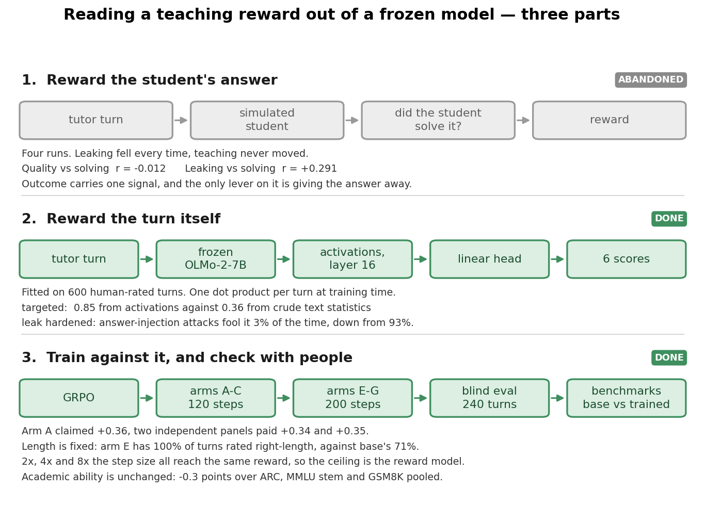

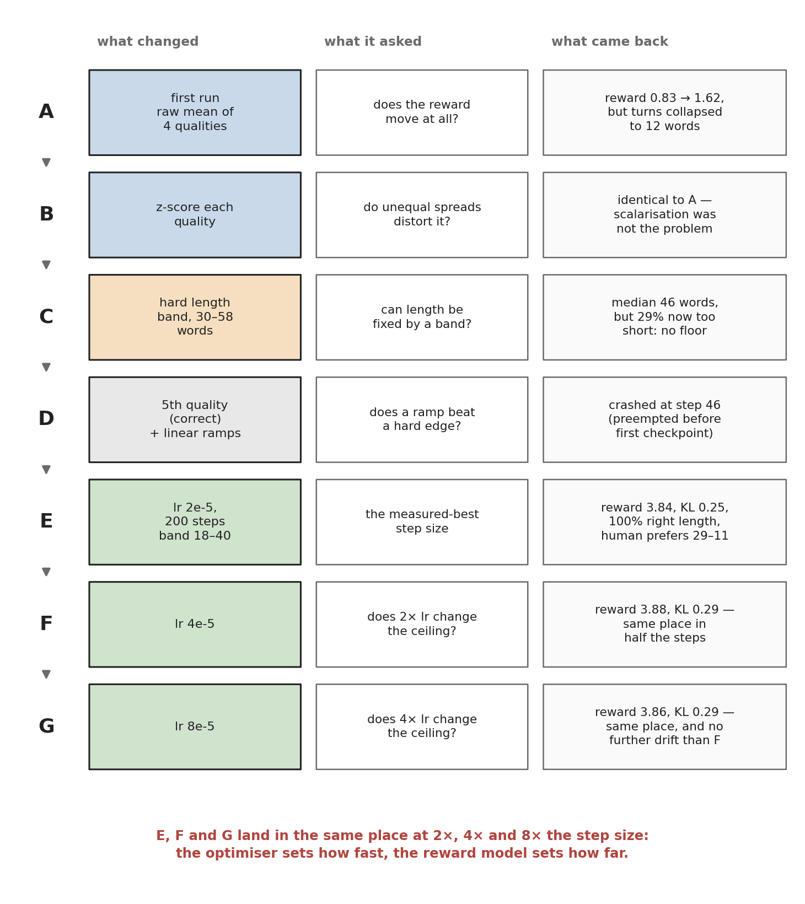

Every training arm, what it changed, what it was asking, and what came back. The arms were sequential
rather than parallel — each was designed after reading the previous one. A and B establish that the
scalarisation is not the problem; C and D are about length; E, F and G vary only the step size and
land in the same place.

## Why we don't reward the student's answer

The obvious design is: let the tutor teach a simulated student, and reward the tutor when the
student then solves the problem. **We tried that for four runs and it never worked** — the tutor
learned to stop giving answers away, and its teaching never improved on the held-out test, across
two reward designs, two datasets, and a bug fix to the leak detector.

The reason turned out to be measurable. Across the collected dialogues:

| how well it predicts the student solving | correlation |
| --- | --- |
| rated tutoring **quality** | **−0.012** (none at all) |
| rated **answer leakage** | **+0.291** |

The best-rated turns had the *worst* solve rates. Whether the student solves it carries exactly one
signal — whether they were told the answer — and the only lever a tutor has on it is giving the
answer away. Penalising leakage doesn't add a teaching signal; it removes the only signal there
was. Which is exactly what we saw: leaking fell, teaching didn't move.

Three consequences, and they shaped this project:

- **A simulated student is trapped between two failures with nothing in between.** Make it weak
  and it *can't* learn — it doesn't have the background, so no amount of good teaching moves it.
  Even expert tutoring shifted the 0.5B student's answers by only about 7 percentage points, and
  that caps anything a reward built on its accuracy could ever detect. Make it strong and it
  *already knows the answer* — asked to play a confused student, it reasons its way to the
  solution anyway, or drops the act and starts explaining like the teacher. Either way you stop
  measuring teaching and start measuring the student's own ability.

  Filtering makes the trap tighter, not looser. The problem set is filtered down to questions the
  weak student gets wrong, and those are exactly the questions a strong model gets right without
  help. The step that creates room for the weak student destroys it for the strong one. We tried a
  3B in the middle and abandoned it.
- **Fixing the reward instead didn't help either.** A learned quality score ended up detecting
  *which model wrote the turn* rather than how good it was, and drove the question-asking rate from
  79% down to 32%. Fixing the leak detector's false alarms more than doubled its precision on maths
  and moved the held-out test by 0.008.
- **So the thing you measure has to contain a teaching signal before any reward built on it can
  find one.** This project drops the student entirely and rates the tutor's turn directly. That's
  why the rubric asks whether the *tutor* said something false and never asks whether the student
  went on to answer correctly.

This history is also why the blind evaluation below matters more than the reward curve. Last time
the reward went up for four runs straight while the thing it stood for didn't budge, and only a
measurement taken outside the reward could have caught it.

## The reward model

Six qualities are rated 1–3 by people: how much the turn **leaks** the answer, how **targeted** it
is to this student's mistake, how **actionable**, how much it **elicits** the student's own
thinking, whether the **length** fits, and whether anything in it is in**correct**. A linear fit
then predicts those ratings from OLMo-7B's internal activations.

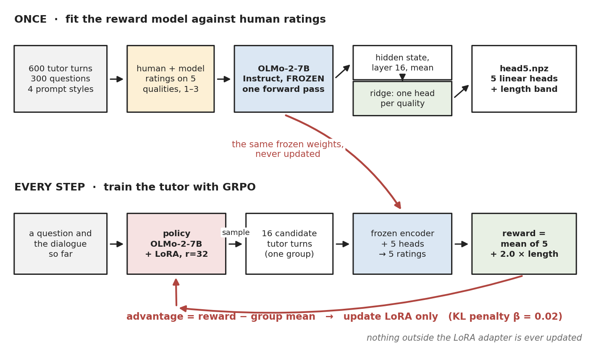

The reward model is fitted once and then called on every rollout. The encoder appears twice and is the
**same frozen weights** both times, which is what keeps the reward stationary while the policy moves:
the policy can't raise its own score by changing its internal representations, because the
representations being read aren't its own. Only the LoRA adapter is ever updated.

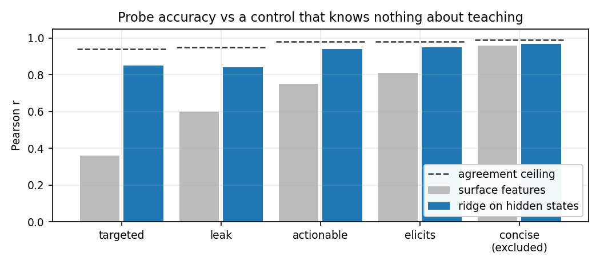

- Grey is the control: eight crude text measurements — word count, question marks, digit density —
  that know nothing about teaching. **Read this bar first.** Where grey reaches the blue bar, the
  rating is really just about the shape of the text and the activations bought nothing.
- `concise` is pure word count, 0.96 grey against 0.97 blue. **Dropped from the reward** for that.
- `targeted` is the payoff: 0.36 from crude text measurements, **0.85** from the activations.
  Whether a turn hits the student's actual mistake is nearly invisible in the shape of the text,
  and the model tracks it anyway.
- A straight-line fit beat a small neural network everywhere, so the reward costs one dot product.
- Middle layers (16–20 of 32) beat both ends. The last layer is busy predicting the next word
  rather than summarising the turn.

**The leak detector is hardened against cheating.** Pasting the answer into an
otherwise-answer-withholding turn used to fool it 93% of the time; after training it on faked
examples like that, **3%** — including on question phrasings and attack styles it never saw.
Accuracy on real turns barely moved, 0.84 → 0.82. The fitting script refuses to ship a reward model
that misses more than 15% of attacks it wasn't trained on.

## The two runs

| | arm A | arm B |
| --- | --- | --- |
| how the six scores are combined | plain average | each score rescaled first, then averaged |
| machine | 1×H100 | 1×H200 |
| W&B | [pm48fp8k](https://wandb.ai/zsophia-massachusetts-institute-of-technology/pedagogy-rm/runs/pm48fp8k) | [k77lk6tm](https://wandb.ai/zsophia-massachusetts-institute-of-technology/pedagogy-rm/runs/k77lk6tm) |

Both: OLMo-2-7B-Instruct, LoRA r=32, lr 1e-5, 32 prompts × 8 samples each, 120 steps (about 3.8
passes over 1000 prompts). The reward comes from a **separate frozen copy** of the model, so the
tutor can't raise its own score by changing its internal representations. Both loaded the identical
reward model; only the way the six scores are combined differs.

**Why arm B exists.** Averaging the scores as-is weights them by how much they happen to vary —
`elicits` varies most, `targeted` least — so a plain average leans about 1.5× harder on the quality
that crude text measurements already predict well (0.81) than on the one they barely predict at all
(0.36). Backwards for this project. Rescaling each score first makes all of them count equally.

## Training curves

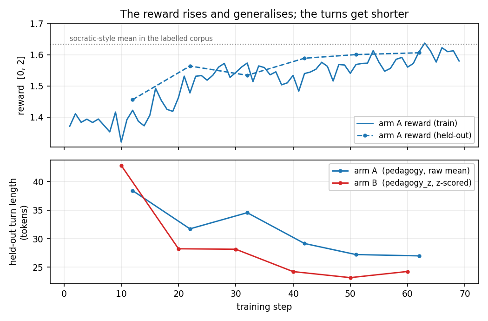

- The held-out line (dashed) tracks the training line (solid) almost exactly, so **the model isn't
  memorising questions**. The 50 test questions don't overlap the 250 training ones.
- **Turns get shorter throughout.** Arm A 38 → 27 words, arm B 43 → 23. The human-rated examples
  averaged around 275 characters; arm B ends near 95.
- Arm B's reward number sits at zero by construction, because rescaling centres it. Judge arm B by
  its individual qualities, not its reward.

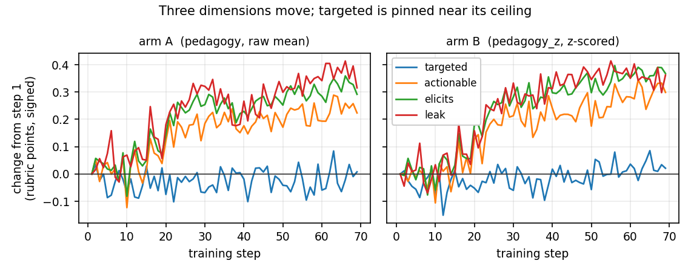

- `leak`, `elicits` and `actionable` all improve by roughly 0.25–0.40 points on the 1–3 scale.
- `targeted` doesn't move in either run.

**`targeted` is flat because of the ratings, not the training.** Pooled over 7 raters:

| quality | rated 1 | rated 2 | rated 3 | average |
| --- | --- | --- | --- | --- |
| `leak` | 45% | 29% | 27% | 1.82 |
| `elicits` | 41% | 29% | 30% | 1.89 |
| `actionable` | 39% | 32% | 29% | 1.89 |
| **`targeted`** | **10%** | 27% | **63%** | **2.53** |

The untrained model already scores 2.58 out of a maximum 3. There's almost no room left for an
improvement to show up, and a linear fit trained on such lopsided ratings hedges toward the middle
and never predicts a full 3.

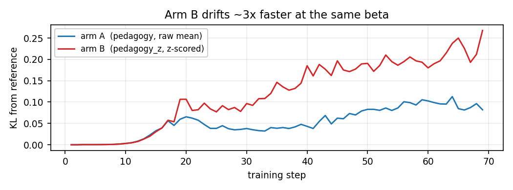

- Arm B moves away from its starting point about **3× faster** at the same setting, because
  rescaling makes the training signal larger. Compare the two arms by how far they've drifted, not
  by step count.

## Is a reward of 1.6 high?

Against the human-rated examples the reward model was fitted on, grouped by the prompting style
that produced them:

| style | turns | average | 90th pct | max |
| --- | --- | --- | --- | --- |
| `socratic` | 146 | 1.634 | 1.834 | 1.976 |
| `brief` | 144 | 1.253 | 1.684 | 1.868 |
| `plain` | 162 | 0.851 | 1.339 | 1.680 |
| `explain` | 148 | 0.746 | 1.296 | 1.600 |

1.60 is about the **78th percentile** and still below the best style's average, so the trained
model is being scored **inside** the range the reward model actually learned from rather than off
the end of it. That stops being true above roughly 1.8, which arm A is now approaching.

## The blind evaluation — the part that decides whether any of this counts

60 held-out questions × 3 models (untrained, arm A, arm B) = 180 turns. Which model wrote each turn
and what the reward model scored it were both stripped out, and the answer key was written to a
separate file. One person rated 51 of them; six AI raters rated all 180 after being calibrated on
26 of her ratings and **checked against the 25 of hers that none of them were shown**.

Every model answered the same questions, so each comparison holds the question and the student's
situation fixed — by far the biggest source of noise in a rating.

| quality | arm A vs untrained | arm B vs untrained | her own ratings, A / B | do the AI raters match her? |
| --- | --- | --- | --- | --- |
| `leak` | **+0.39** (won 69%) | **+0.40** (72%) | +0.24 / +0.41 | 0.37 |
| `actionable` | **+0.54** (69%) | **+0.71** (82%) | **+0.53** / **+0.41** | 0.03 |
| `elicits` | **+0.41** (64%) | **+0.45** (70%) | **+0.47** / **+0.59** | 0.21 |
| `correct` | **+0.17** (65%) | **+0.27** (73%) | +0.18 / +0.12 | 0.38 |
| `targeted` | +0.01 | +0.02 | +0.18 / +0.06 | 0.24 |
| `length_fit` | +0.05 | +0.05 | +0.00 / −0.06 | 0.26 |

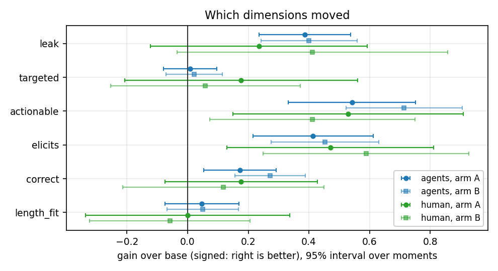

Bold means the gain is larger than its margin of error. Percentages are the share of questions
where that model's turn was rated better. The last column runs 0 (chance) to 1 (perfect).

**Disagreeing on individual turns and agreeing on which model is better are two different things,
and mixing them up would have thrown away the result.** On `actionable` the AI raters match the
human at 0.03 — no better than chance at ranking one turn against another. Yet both produce the
same gap between models, in the same direction, at nearly the same size (+0.54/+0.71 against
+0.53/+0.41). Ranking noise on individual turns cancels out across sixty questions; a consistent
preference for one model doesn't. So near-zero agreement rules these raters out for *labelling
training data* and says very little about *comparing two models*.

**The one regression, and the AI raters understate it.** `length_fit` scores 2 for the right length
and 1 or 3 for the two ways of being wrong, so its average is meaningless on its own — a model
split evenly between too-short and too-long averages exactly 2.0 and looks perfect. Split apart:

| | too short | right | too long |
| --- | --- | --- | --- |
| untrained | 12% | 71% | 18% |
| arm A | **29%** | 71% | 0% |
| arm B | **35%** | 65% | 0% |

Her ratings. Training wiped out over-long turns completely and paid for it with roughly triple the
too-short rate, so the net score barely moves. The AI raters put too-short at 20%/15% — about half
the real figure. This is the one place where trusting them alone would have hidden a genuine loss,
and it's the shortening visible in the training curves showing up as a measurable defect.

**The combined reward, measured three ways.** The same combination the reward model optimises,
applied to the human and AI ratings, so all three are the same quantity. The absolute levels aren't
comparable across the three (different scales), so read the gain:

| who's measuring | untrained | arm A | arm B | gain, A | gain, B |
| --- | --- | --- | --- | --- | --- |
| AI raters, 180 turns | 1.32 | 1.65 | 1.71 | +0.34 | +0.40 |
| her, 51 turns | 1.31 | 1.66 | 1.68 | +0.35 | +0.37 |
| **reward model** | 1.23 | 1.60 | 1.72 | **+0.36** | **+0.49** |

**Arm A is clean:** the reward model claims +0.36, and two independent sets of raters pay +0.34 and
+0.35. That three-way agreement is the strongest single piece of evidence here that the training
did something real. **Arm B is where a gap opens** — +0.49 claimed against +0.37 and +0.40 paid,
about a third more than anyone actually buys. Mild, but that's what it looks like when a model
starts optimising the scorer rather than the thing the scorer stands for, and it shows up in the
arm that pushed harder.

One more thing in the reward scores: the **variety across turns collapses**. Spread falls from 0.36
untrained to 0.18 and 0.13. The trained models are less than half as varied — a model settling into
one shape of answer, which is the same shortening seen from another angle.

**Head-to-head preferences, blind, same question on both sides.**

| comparison | result | probability of this by chance | picked the turn the reward model preferred |
| --- | --- | --- | --- |
| arm A vs arm B, 17 pairs | 8 – 9, no ties | 100% | 47% |
| arm A vs untrained, 30 pairs | **18 – 10**, 2 ties | 19% | **68%** |

The two arms are **the same model** as far as a person can tell. Against the untrained model,
training wins 64% of the time — right direction, but 28 decided pairs isn't enough to rule out
chance; a 64% effect needs about 60. Combined with the ratings above, which rest on many more
judgements and put arm A ahead on 76% of questions, training did beat the untrained model.

The last column is the more useful half. The reward model **can't** tell two trained models apart
(47%, and it scored the two sides within 0.07 of each other), but it **can** tell trained from
untrained (68%). That's a reward model with real but limited resolution, which is the honest
description of it.

One side note, not statistically solid either way: between two trained turns she picked the longer
one 65% of the time, and against the untrained model she picked the *shorter* one 68% of the time.
Both point at an ideal length in between the two — the same story the too-short/too-long split
tells.

**`correct` passed the bar it failed the first time, and is now in the reward model.** It was
dropped originally because raters didn't agree on it; with a rewritten definition they now do, and
the activations predict it at **0.63** against a crude-text baseline of 0.47. It's the weakest of
the five, and the only one that asks whether the tutor said something false. Saved as
`data/head5.npz`.

**Why the AI ratings weren't used to retrain the reward model.** The six models agree with each
other far more than they agree with the human, and what they agree on is largely the shape of the
text:

| quality | AI raters agree with each other | ...with the human | crude text predicts the AI raters | ...predicts the human |
| --- | --- | --- | --- | --- |
| `actionable` | 0.76 | 0.06 | **0.74** | 0.23 |
| `elicits` | 0.57 | 0.06 | **0.61** | 0.34 |
| `leak` | 0.50 | 0.22 | 0.64 | 0.28 |
| `correct` | 0.49 | 0.27 | 0.34 | 0.37 |
| `targeted` | 0.58 | 0.27 | 0.08 | 0.11 |
| `length_fit` | 0.55 | 0.26 | 0.77 | 0.72 |

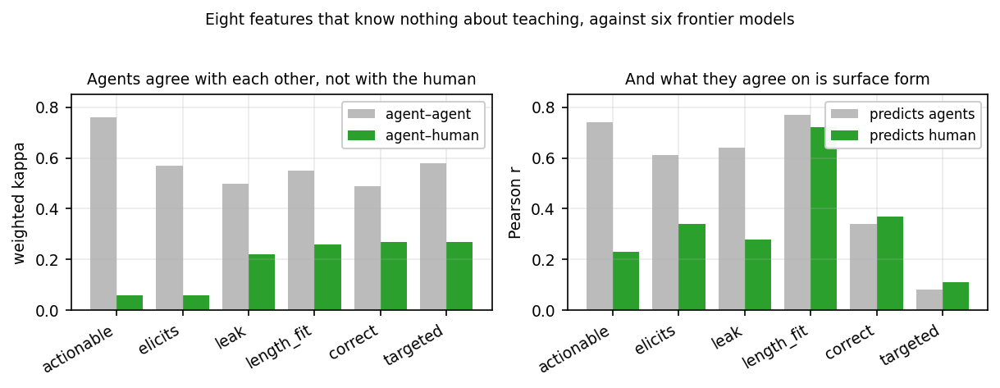

Three quarters of what the AI raters collectively say about `actionable` can be reproduced by eight
crude text measurements. Train a reward model on that and run RL against it, and the tutor
optimises the shape of its text — which is the shortening already measured. `correct` and
`targeted` are the two where the AI raters are clean, and they're the two safe to average.

The other half of the story is that there's little room to disagree in: `actionable` is rated 3 on
74% of turns by the AI raters and 65% by the human, `elicits` 57% and 67%. Everyone is choosing
between 2 and 3. **And the overall distributions match on all six qualities** — the human and the
AI raters hand out the same mix of scores and differ only on which turn gets which. That's exactly
the situation where averaged AI ratings are trustworthy for comparing models and untrustworthy for
labelling individual turns.

## Arm C: fixing the length, and what that exposed

The blind evaluation found one clear regression — turns had become too short — so arm C changed
two things and nothing else. It added `correct` to the reward model, and it added a flat bonus
for turns landing between 30 and 58 words. Same plain-average scoring as arm A, same hardware,
same batch settings, so the reward is the only difference.

**Why a flat band rather than a smooth curve.** Every quality the reward model scores gets
*better* as a turn gets shorter — measured at −0.26 per log-word across the five, and the human's
own ratings agree at −0.49. No reweighting of those five can express "this is now too short",
because they all point the same way. Only a term that turns around can. From 1131 length
judgements, 21–58 words is the 90%-acceptable range, with a gentle shoulder below and a cliff
above (98% acceptable at 55 words, 45% at 75).

Inside a flat band the term is constant, so the pull toward brevity slides the policy to the
lower edge and parks it there — which makes the edge the target, not the limit. That is a
feature: the resting length is a number you write down rather than one you infer. It is also
more robust than the smooth alternative, which rests at 25 words at the measured slope but moves
to 19 or 32 as that slope drifts, and the slope does drift during training. The weight of 2.0
was chosen because the failure mode is a cliff rather than a drift: too small and the band stops
binding and the policy collapses to five words, which happens below 1.0 at the measured slope.

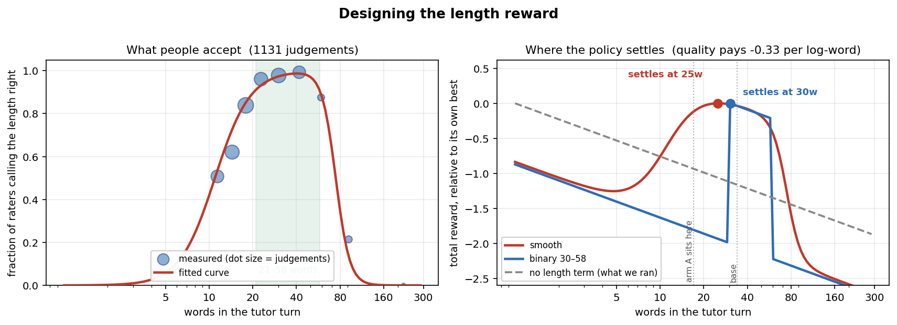

**The length fix worked completely.** Over 120 steps the share of turns inside the band climbed
monotonically from 0.38 to 0.75, while sequence length held flat at 48–51 tokens — so the
distribution tightened into the band rather than drifting. Arm A had collapsed from 38 to 27
tokens over the same span. Sampled on the same 60 held-out questions:

| policy | median words | too short | right | too long |
| --- | --- | --- | --- | --- |
| base | 34 | 9% | 77% | 14% |
| arm A | 17 | 25% | 75% | 0% |
| **arm C** | **46** | **1%** | **97%** | **3%** |

Predicted from the fitted curve rather than measured; back-tested against the first pool it
understates the failure rate by about four points, so read it as a slight underestimate.

**And then the two ways of judging it disagreed, sharply.**

| judge | verdict on arm C vs arm A |
| --- | --- |
| the reward model | worse (leak 1.45 → 1.86) |
| six agent raters | worse: **−0.07** overall, winning 45% of moments |
| **the human, 40 blind pairs** | **better: 29–11, a 72% win rate, p = 0.01** |

The human result is the first in this project significant on its own without the ratings
propping it up. It also runs against both automated judges: on those same 40 pairs the human
agreed with the reward model's ordering **48% of the time**, no better than chance.

**The cause is measurable, and it is the same one in both.** Everybody ties leaking to length,
but by different amounts:

| judge | how strongly leaking tracks length |
| --- | --- |
| the reward model's head | **+0.70** |
| six agent raters | +0.59 |
| the human, 600-turn corpus (3625 judgements) | **+0.43** |

The head is about 1.6× as length-sensitive on `leak` as people are. Some of that coupling is
real — longer turns do give more away — but the head learned a steeper version, and the agents
learned a steeper version too. Forcing turns from 17 to 46 words therefore cost arm C more
`leak` in the reward's eyes than it costs in a person's, and that single distortion was enough
to flip the verdict. It is the sharpest demonstration so far of why the blind check exists: the
reward and its imitators agreed with each other and were wrong together.

**The confound, stated plainly.** Every arm C turn is longer than its arm A counterpart, so
length and arm are perfectly correlated in these 40 pairs. The result cannot separate "arm C
teaches better" from "longer turns are preferred at this moment in this task". What it does
establish is that the human preference runs *opposite* to the reward's, which is the part that
matters for what to build next.

## Second round: a new rubric, a measured learning rate, and two failed repairs

### The rubric was rebuilt, and it agrees far better

Four literature reviews and three measurements on our own labels said the same thing, so the six
dimensions were replaced. The measurements were the decisive part:

- `actionable` and `elicits` correlate at **0.95** in the human labels. One dimension, two names,
  counted twice in the reward.
- The five dimensions have an effective rank of **2.9**; the first component explains 47%.
- Nine turns score top-quartile on `leak`, `targeted`, `actionable` **and** `elicits` at once, and
  their median length is **12 words** against the corpus's 30. The collapse the trained policy
  found was visible in the labels before any training happened.

The diagnosis the literature supplied: every old dimension measured what the tutor **withheld**,
none measured what it **contributed**. A rubric made only of withholding measures has its optimum
at maximal withholding. Against 70 effect sizes, elaborated feedback is d=0.49 and bare
right-or-wrong is **d=0.05** — we were maximising the d=0.05 end.

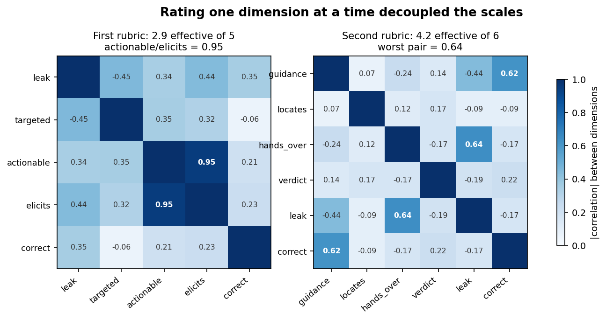

The replacement is `guidance`, `locates`, `hands_over`, `verdict`, `leak`, `correct`, plus
`student_state` rated on the student's message and never rewarded. Rated by five models, one
complete pass per dimension so that judging one cannot colour the next:

| dimension | agreement (κw) | what it replaced |
| --- | --- | --- |
| `hands_over` | **0.82** | `elicits`, which was 0.56 |
| `leak` | **0.78** | unchanged wording, was 0.51 |
| `correct` | **0.73** | same construct, now with the worked solution shown; was 0.51 |
| `locates` | **0.70** | `targeted`, which was 0.57 |
| `verdict` | **0.66** | new |
| `guidance` | 0.46 | new, and the weakest |

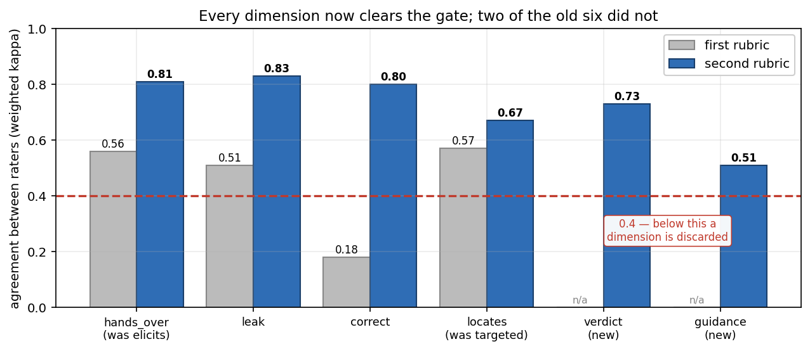

All six clear the 0.4 gate where two of the old six did not. The two rewrites both beat what they
replaced, and the reason is the one the literature predicted: asking "does the turn hand over the
next move" scores 0.82 where asking "how much thinking does it ask for" scored 0.56. The same
construct, framed behaviourally instead of as a judgement about cognition.

`correct` is the clearest single fix. It failed at κ 0.18 in the first round because the rater was
being asked to re-derive the mathematics from the question; showing a generated worked solution
alongside the turn took it to 0.73.

### The reward is a length penalty wearing a rubric

Agreement was the wrong thing to check on its own. The more useful question is what the dimensions
correlate *with*, and the answer explains most of the project's history. Running `head5.npz` over all
600 labelled turns, and the 7-rater consensus labels over the same turns:

| dimension pair / relation | probe | labels |
|---|---|---|
| `actionable` ↔ `elicits` | **0.96** | **0.95** |
| `leak` ↔ log(words) | +0.64 | +0.53 |
| `correct` ↔ log(words) | −0.58 | −0.43 |
| `elicits` ↔ log(words) | −0.52 | −0.50 |
| `actionable` ↔ log(words) | −0.42 | −0.40 |
| `targeted` ↔ log(words) | **+0.03** | **+0.02** |
| mean \|r\| among the five | 0.43 | 0.37 |
| first principal component | 51% | 47% |
| effective rank | 3.07 / 5 | 3.31 / 5 |

**The probe amplifies the label structure but invents none of it.** Every correlation matches the
labels in sign, and is 0.01–0.15 larger in magnitude. So the rank-3-of-5 problem lives in the
*ratings*; the probe's contribution is a mild sharpening, worst on length.

**Then apply the reward signs, and the picture resolves.** `leak` is negated in the reward, so its
+0.64 becomes −0.64 and lines up with the other three:

| signed as rewarded | probe | labels |
|---|---|---|
| `leak` | −0.64 | −0.53 |
| `correct` | −0.58 | −0.43 |
| `elicits` | −0.52 | −0.50 |
| `actionable` | −0.42 | −0.40 |
| `targeted` | +0.03 | +0.02 |
| **the reward itself** | **−0.60** | **−0.57** |

Four of five dimensions push toward shorter turns and the composite reward correlates with length at
−0.60. That is not a side effect to be tuned away, it is what the reward mostly *is*, and it explains
the sequence rather than being another observation in it: why arm A collapsed to 12 words, why a
length band had to be added at all, why that band ends up supplying ~70% of the measured gain (it is
the only term pushing back), and why the probe dimensions collected only 40% of their available
headroom — the rest sits behind the collapse the band blocks.

`targeted` is the exception at +0.03, and it is also the dimension where surface features do worst
(0.36 against the activations' 0.85). It is the one dimension measuring something length cannot fake,
and it is the one the policy improved least on — 21% of its headroom.

### Does the V2 rubric fix this? Half of it.

V2 exists partly to break this coupling: `guidance` ("does the turn supply anything usable") should be
length-*positive*, offsetting the others. Nine raters scored 44 turns on all six V2 dimensions, so it
can be checked rather than assumed.

| | V1 labels (n=600) | V2, all 44 | V2, **real turns only** (n=20) |
|---|---|---|---|
| mean \|r\| | 0.37 | 0.22 | 0.28 |
| max \|r\| | **0.95** | 0.65 | 0.70 |
| first PC | 47% | 36% | 40% |
| effective rank | 3.31 / 5 | 4.88 / 6 | **4.53 / 6** |
| composite vs log(words) | **−0.57** | −0.37 | **−0.62** |

The third column is the honest one. 24 of the 44 V2-labelled turns are **manufactured negatives,
each corrupted along a single dimension** — which decorrelates the dimensions mechanically, by
construction, and has nothing to do with the rubric. Dropping them leaves 20 real turns.

**On redundancy, V2 is a genuine fix.** The 0.95 duplicate is gone (max 0.70), and effective rank goes
from 3.31 of 5 to 4.53 of 6 even on real turns. V2 measures close to six things where V1 measured
about three.

**On length, V2 changes nothing.** The composite still correlates −0.62, against V1's −0.57. Per
dimension on real turns: `correct` −0.66, `verdict` −0.53, `hands_over` −0.51, `leak` −0.26,
`guidance` −0.12, `locates` −0.06. The two dimensions designed to be length-neutral are, and the
other four swamp them. `guidance` was supposed to be the length-*positive* counterweight and came out
at −0.12 — neutral, not positive.

At n=20 the interval on −0.62 is roughly [−0.84, −0.24], so this cannot claim V2 is *worse*. What it
rules out is the hope that V2 fixes it.

**Which means rubric wording is the wrong lever for the length problem.** Decorrelating the
dimensions from each other and decorrelating them from length are different problems; V2 solves the
first and leaves the second untouched. Raters score shorter turns higher on most pedagogical qualities
under either rubric — brevity is confounded with quality in their own judgements, so any head fitted
on this corpus inherits it. That points at the corpus, not the rubric: a set of turns where length and
quality vary independently is the thing that has been identified as necessary twice now and still does
not exist.

### Negative examples had to be manufactured, and half the recipes failed

The pool had no bad turns to learn from: in the 20-turn pilot `locates` never received a 1 at all
and `guidance` received one 5% of the time. So real turns were minimally corrupted along one
dimension each — the approach that hardened `leak` from 93% fooled to 3% — and then rated blind.

| corruption | hit rate across raters |
| --- | --- |
| `correct`, `hands_over`, `leak` | **100%** |
| `verdict` | 75% |
| `guidance`, `locates` | **50%** |

Both failures shared a cause: "strip out the content" and "no longer point at anything specific"
can be satisfied halfway. Restated as prohibitions — not one number or content word from the
student's message may appear — the overlap with the student's own words fell from 5.6 to 0.2 for
`locates` and 6.2 to 2.4 for `guidance`. `guidance` remains the harder one, because a turn that
restates the question necessarily reuses its words.

**One methodological failure worth recording.** The corrupted turns' ids encoded which dimension
had been corrupted — `nloca…` for `locates`, `nguid…` for `guidance`. A rater read the answer off
the id prefix instead of judging the turn, and said so in its report; its labels were discarded
and the ids are now salted hashes. It only surfaced because that rater described its method
honestly, which is a thin thing to have relied on.

### The learning rate was measured, not chosen

Four 35-step runs, identical apart from the rate, compared on reward gained per unit of KL drift —
because reward alone ranks runs by learning rate and says nothing:

| rate | reward gain | KL | gain/KL | tokens | in band |
| --- | --- | --- | --- | --- | --- |
| **2e-5** | +0.526 | 0.074 | **7.11** | 50→40 | 0.90 |
| 1e-5 | +0.348 | 0.080 | 4.35 | 50→31 | 0.81 |
| 4e-5 | +0.526 | 0.122 | 4.31 | 50→43 | 0.92 |
| 8e-5 | +0.606 | 0.172 | 3.52 | 49→36 | 0.94 |

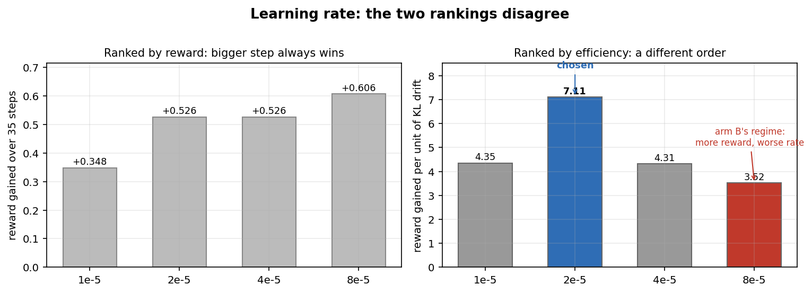

2e-5 buys the same gain as 4e-5 for 40% less drift. Above it the pattern is arm B's — more reward
at a worse exchange rate.

**The token column is the more interesting result.** The *slowest* rate produced the *shortest*
turns, 31 words against 40, and in-band share rose monotonically with the rate. At 1e-5 the head's
pull towards brevity still dominates and the policy sits at the band's lower edge; from 2e-5 up it
reaches the band and stays. The efficient rate is also the one that lands where the rubric says.

### Two attempts to fix `leak`'s length coupling, both failed

The head ties leaking to length at **+0.70** on policy-generated turns against the human's +0.43,
and that distortion is what made both automated judges call arm C worse when the human preferred
it 29–11. Two repairs were tried on the existing fit:

| attempt | coupling after |
| --- | --- |
| baseline | +0.70 |
| rank-1 correction toward the labels' own coupling | +0.67 |
| residualising length out of states and target before fitting | **+0.74** |

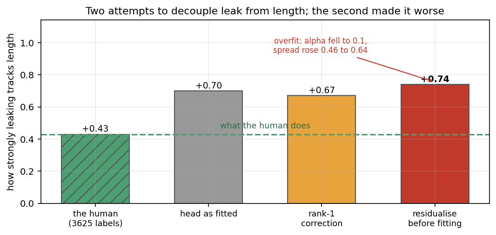

The second made it worse, with `alpha` collapsing to 0.1 and prediction spread rising from 0.46 to
0.64 — overfitting. The diagnosis is that on the *training* turns the head's coupling is 0.44
against the labels' 0.37, so there is nothing to correct in-distribution; the 0.70 is
**distribution shift**, and no correction estimated in-distribution reaches it. This needs labels
on policy-generated turns, which is the same requirement as fitting a head to one person's
judgement rather than a seven-rater average.

Until then the explicit length term is the only predictable lever on length, which is why it
became a ramp rather than a band: a hard band scores 59 words and 200 words identically, so
nothing pushes a runaway turn back.

### The learning-rate ladder: the ceiling is the reward model, not the optimiser

Three runs at 2e-5, 4e-5 and 8e-5, identical in every other respect — same head, same length ramp,
same 200 steps. This is the comparison arm B could not provide, because z-scoring its reward raised
the effective step size 3.4× as a side effect and confounded scalarisation with step size.

| arm | rate | held-out reward | words | KL, final | KL, peak | steps to reach 3.80 |
| --- | --- | --- | --- | --- | --- | --- |
| E | 2e-5 | 3.84 | 27.2 | **0.25** | **0.31** | 133 |
| F | 4e-5 | **3.88** | 27.7 | 0.29 | 0.41 | 69 |
| G | 8e-5 | 3.86 | 28.2 | 0.29 | 0.41 | 65 |

Reward and length are measured on the held-out questions; KL is the mean over the last ten steps and
its peak over the run; the last column is the first step whose nine-step mean reaches 3.80. An
earlier version of this table listed 33.1 / 33.7 / 35.0 under "words" — those were `sequence_lengths`,
which counts **tokens**, and the word counts are the numbers above.

**Four times the learning rate bought 0.02 more reward and arrived twice as fast.** The three arms
converge to the same place; the faster ones only arrive sooner. That is a different result from the
one the question assumed: the reward is not something a bigger step can push higher, because the
ceiling is set by what the reward model can express, not by how hard it is optimised.

**The drift saturates rather than scaling with the rate.** Going 2e-5 → 4e-5 costs 0.04 nats of final
drift; going 4e-5 → 8e-5 costs nothing, with F and G finishing at the same 0.29 and peaking at the
same 0.41. So the ladder is not a straight trade of drift for speed, and past 4e-5 the extra step
size buys arrival time only. That makes **4e-5 the better-supported choice than the 2e-5** the
reward-per-drift measurement picked — that measurement ran for 35 steps, before either arm converged.

Arm E's own curve says the same thing from the other direction. Reward rose 3.13 → 3.84 over 200
steps, but the 20-step gains were +0.31, +0.14, +0.13, +0.03, +0.02, then eight increments of 0.03
or less. Everything happened in the first 80 steps; the last 120 bought 0.08. Extending from 120 to
200 steps was cheap insurance, not a lever.

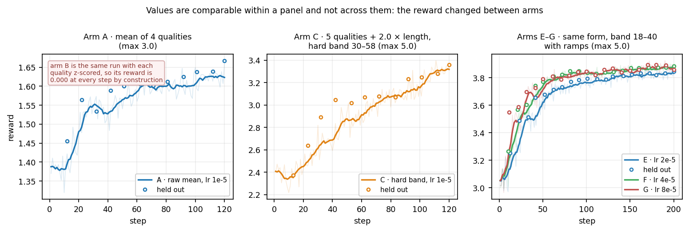

One panel per reward *definition*, because the reward changed four times and values are not
comparable across those changes. Open circles are the held-out questions, tracking the training curve
throughout — the policy is not memorising the 250 training questions.

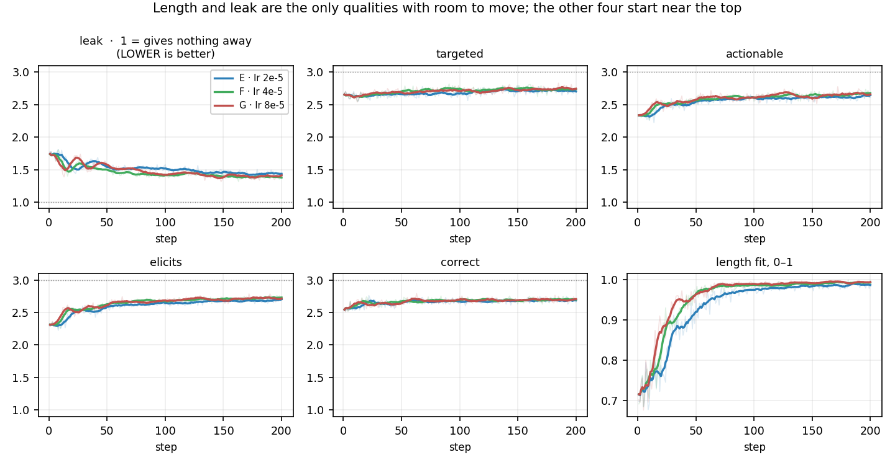

Only `length` and `leak` have real room to move. `targeted`, `actionable`, `elicits` and `correct` all
start near 2.6 of 3 and end within 0.15 of where they began — the ceiling above, seen per-quality.

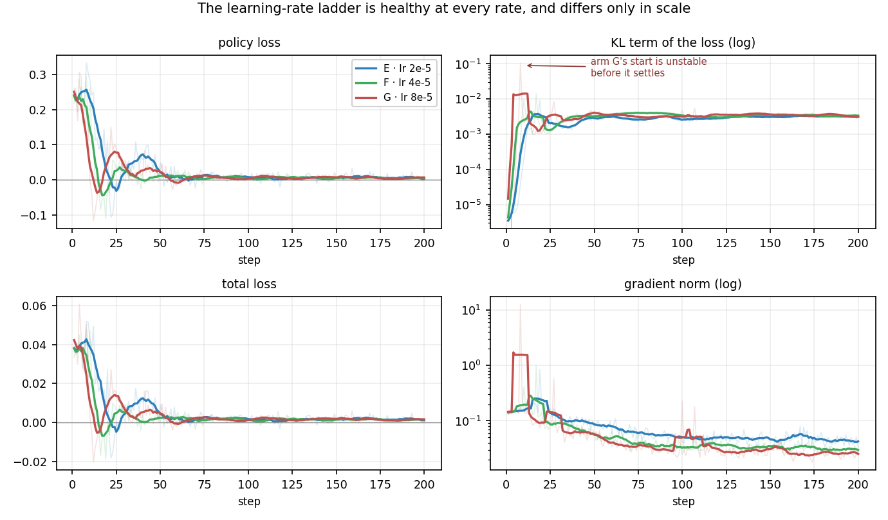

The optimisation is well behaved at all three rates. Both spike panels are on log axes because arm G
hits a gradient norm of 12.8 and a KL term of 0.106 in its first ten steps against medians of 0.033
and 0.0034 — the only sign that 8e-5 starts unstably before recovering. Arm F's curve is stitched from
three W&B runs, since the partition preempted it twice and each requeue resumed from checkpoint.

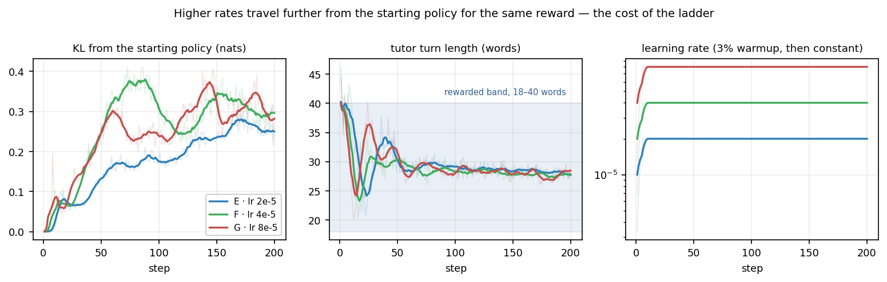

Length falls *into* the rewarded band and stops, which is what the ramp was built to do and what arm
C's hard band failed at. Four other diagnostics are constant and so aren't plotted: clipped tokens are
exactly 0, importance-ratio variance 1e-15, mean advantage 1e-17, and no group of 16 samples ever
scored uniformly — all consequences of strictly on-policy single-epoch updates, where the importance
ratio is 1 by construction.

### All seven arms on one axis

The reward changed four times, so no reward column compares every arm. But the four *original*
qualities — `leak`, `targeted`, `actionable`, `elicits` — were scored by the same four heads in every
run, so their mean is comparable throughout.

| arm | rate | 4-quality mean, start | end | gain | KL drift | words |
| --- | --- | --- | --- | --- | --- | --- |
| A | 1e-5 | 1.370 | 1.627 | +0.257 | 0.158 | 38 → 27 |
| B | 1e-5, z-scored | 1.388 | 1.724 | +0.336 | **0.567** | 43 → 23 |
| C | 1e-5, band 30–58 | 1.386 | 1.502 | +0.116 | 0.184 | 46 → 39 |
| D | 1e-5, ramps | — | — | crashed at step 46 | — | — |
| E | 2e-5, band 18–40 | 1.387 | 1.650 | +0.263 | 0.250 | 46 → 28 |
| F | 4e-5 | 1.382 | 1.685 | +0.303 | 0.293 | 45 → 28 |
| G | 8e-5 | 1.375 | 1.677 | +0.302 | 0.285 | 44 → 28 |

Two things only this table shows. **Arm B's drift was 3.6× arm A's** (0.567 vs 0.158) at the same
nominal learning rate — which puts a number on the confound described qualitatively above: z-scoring
shrank the reward scale, and with centred advantages that raises the effective step size rather than
reweighting the qualities. Arm B was never a test of scalarisation. And **arm C gained least of any
completed arm** on these four (+0.116 against +0.26 to +0.34), because it spent its capacity getting
longer — the same trade that cost it `leak` and made the reward model rank it below arm A while the
human ranked it above.

**What this settles about arm B.** Arm B claimed +0.49 and was paid +0.37 at 3.4× the step size.
Arms F and G are 2× and 4× arm E's step size and post the same reward as it does, so the extra
claiming in arm B was not a generic consequence of larger steps — the scalarisation was doing
something the step size alone does not. The z-scoring question deserved the matched-step-size test
it never got.

**Where the remaining headroom is.** Arm E ends at 3.84 of a possible 4.20. The length term is at
1.96 of 2.00 — effectively saturated, with 98% of turns inside the target band — and the five
pedagogical qualities at 1.88 of 2.20. So 85% of what is left sits in the qualities, and `leak` is
the furthest from its ceiling of any of them, which is the dimension whose length coupling two
repairs failed to fix.

### The ladder, rated blind: the best result so far, and the rates are interchangeable

60 held-out questions answered by all four policies — untrained base plus the three learning rates
— giving 240 turns, blinded and rated by five calibrated models.

| dimension | arm E vs base | arm F vs base | arm G vs base |
| --- | --- | --- | --- |
| `elicits` | **+0.48** (73%) | **+0.52** (78%) | **+0.49** (75%) |
| `actionable` | **+0.43** (72%) | **+0.41** (66%) | **+0.39** (66%) |
| `leak` | **+0.33** (67%) | **+0.32** (70%) | **+0.31** (64%) |
| `correct` | **+0.19** (66%) | **+0.17** (68%) | **+0.13** (62%) |
| `length_fit` | **+0.18** (66%) | **+0.18** (67%) | **+0.17** (66%) |
| `targeted` | **+0.14** (69%) | **+0.19** (69%) | **+0.13** (68%) |
| **total** | **+0.35** (80%) | **+0.36** (86%) | **+0.33** (80%) |

**Every arm beats base on every dimension.** No previous arm did: arm C won on four and lost
`leak`, because getting longer cost it there. Arm E wins on all six — it withholds *more* than base
while also being the right length, which is the combination the earlier arms could not reach
together.

**The length problem is solved.** 100% of turns rated right-length, zero too-short and zero
too-long, against base's 8% / 82% / 10%. Arm C's hard band left 29% too short by the human's own
labels; the ramp with the band moved down to 18–40 words removed both tails.

**The three rates are interchangeable.** Totals of 1.73, 1.74, 1.71, and every dimension within
noise of the others. Four times the learning rate changed nothing except the number of steps
needed. Combined with the reward curves converging to 3.84–3.88 and the KL drift rising 0.25 → 0.29
and then stopping, the conclusion is that the optimiser chooses how fast, and the reward model
chooses how far.

**The caveat that has held all day holds here too.** These are agent raters, and on arm C they were
confidently wrong — they tie leaking to length at +0.59 against the human's +0.43, and that
distortion made them rank arm C below arm A when the human preferred it 29–11. Arm E is shorter
than arm C, so the bias runs *in its favour* this time, which is exactly when it should be trusted
least. The 48 blinded preference pairs are what settles it.

## Did it cost the model any academic ability?

Everything measured so far compared tutoring against tutoring. But the policy was optimised for 200
steps on one narrow thing — the shape of a single turn — against a reward that says nothing about
whether the model can still do arithmetic or recall a fact. Narrow objectives are well known to cost
capability elsewhere, and none of the instruments used up to this point would have noticed.

So both trained arms and the base model were asked to *answer* questions rather than teach them, on
three benchmarks none of them were trained on: ARC-Challenge (science), a stem slice of MMLU (school
maths, biology, chemistry, physics), and GSM8K (grade-school word problems). 400 items each, greedy
decoding, identical items for every arm.

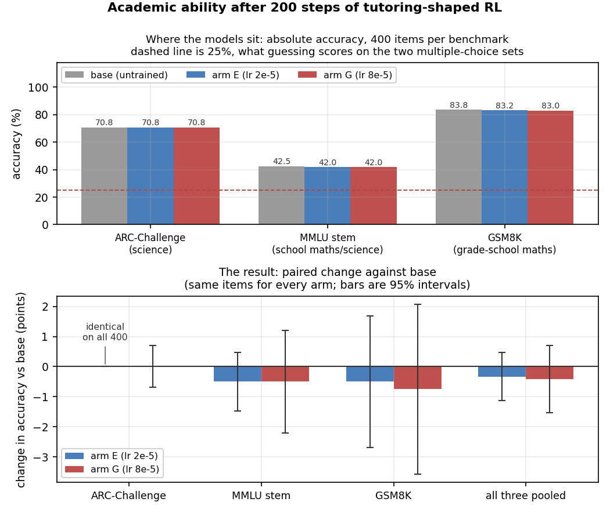

Top panel is where the models actually sit, which the difference plot alone can't tell you: MMLU stem
at 42.5% is close enough to the 25% guessing floor that little of the scale is in play, while GSM8K at
83.8% has little headroom left — a −0.3 point change means something different in each case. Bottom
panel is the result, and it's plotted as a difference because at 42% and 84% the raw bars are visually
identical whatever the gap between them.

| | base | arm E (lr 2e-5) | arm G (lr 8e-5) |
|---|---|---|---|
| ARC-Challenge | 70.8% | 70.8% | 70.8% |
| MMLU stem | 42.5% | 42.0% | 42.0% |
| GSM8K | 83.8% | 83.2% | 83.0% |
| **pooled change** | — | **−0.3% [−1.1, +0.5]** | **−0.4% [−1.5, +0.7]** |

**Nothing moved.** Pooled over all 1200 items, arm E is 0.3 points below base and arm G 0.4 points,
both far inside noise (p = 0.54 and 0.56, McNemar on the items where they disagree). On
ARC-Challenge arm E is not merely equal to base but *item-for-item identical*: not one of 400
questions changed hands.

**The null is a real one, not an underpowered one.** This distinction matters more than the p-value,
because "we saw no change" and "we could not have seen a change" print the same way. The pooled
interval excludes any drop worse than about 1.5 points, so the claim is bounded rather than merely
unrefuted. Per task the intervals are wider — GSM8K alone reaches −3.6 — which is why the pooled
column is the one to read.

**Why this is the expected result, and what it would have meant otherwise.** The KL drift at the end
of arm E is 0.25 nats, which is a small distance to have travelled; a LoRA adapter at rank 32 on a
frozen 7B base has limited capacity to overwrite what the base knows. Had capability dropped
anyway, it would have implied the reward was pushing against general competence rather than
orthogonally to it, and the tutoring gains would have been paid for rather than free. They appear to
be free.

**Two harness bugs had to be fixed before these numbers meant anything**, and they are worth
recording because both produced confident, plausible, wrong answers. First, generation was capped at
24 tokens on the assumption the models would answer a direct question directly; instruction-tuned
models reason first, so half the GSM8K generations were truncated mid-working and measured accuracy
came out at 1.8% against a published ~67%. Second, even with a 512-token budget, 30% of MMLU items
were still unparseable, and that failure is *correlated with the thing being measured* — a more
verbose policy loses more items to truncation, so arm G appeared to drop from 41.0% to 36.2% when
scoring the options by loglikelihood instead shows 42.5% versus 42.0%. A parse-failure rate that
differs between arms is not noise; it is a bias with a sign.

## What we still don't know

- **The test questions were held out from the tutor, but not from the reward model.** 250 training
  and 50 test questions with no overlap — but 45 of the 50 were among the questions the reward
  model was fitted on. Nothing leaks (the reward model is frozen), but any agreement measured here
  flatters it. Next round should hold questions out from both.
- **One human, 17 questions rated and 28 pairs decided.** Every claim about which model is better
  rests on 60 questions rated by AI raters whose per-turn agreement with her is weak, plus her own
  17. The two agree, which is why either is believable, but neither is a large sample. The
  head-to-head test that would settle it independently is underpowered; the remaining 30 pairs
  already exist and would get there.
- **Only the final checkpoint was tested.** Checkpoints were saved every 10 steps, so if quality
  peaked before step 120 while the reward kept climbing, we wouldn't know.
- **Why nobody agrees on `elicits` and `actionable` per turn is unexplained.** Both are nearly
  maxed out on these turns, so what's left to disagree about may just be personal taste rather than
  a signal anything could learn.

## What to do next

1. **Recalibrate `leak` so its length sensitivity matches a person's.** It is +0.70 against the
   human's +0.43, and that gap alone flipped the verdict on arm C. The coupling should be reduced
   to match rather than removed, because part of it is real. Likely doable from the existing
   600-turn corpus with no new ratings.
2. **Rebuild the data and the rubric so length and quality are not confounded.** The arm C
   comparison could not separate "better teaching" from "longer", because every arm C turn was
   longer. A corpus that varies the two independently is what makes the next comparison readable,
   and it is worth more than another training run against the current reward.
3. **Stop using absolute agent ratings across a length change.** They tie leaking to length at
   +0.59 and got arm C backwards. Preference judgements, where both turns are seen side by side,
   were the instrument that got it right.
4. **Test intermediate checkpoints.** If quality peaks before the reward does, that's where to
   stop — and finding that is a better result than a run that happened to stop early.
5. **Hold some questions back from the reward model too**, so future human-vs-model agreement
   numbers mean what they appear to mean.

Arm B is settled and needs no further work: 8–9 head to head, one quality out of six on ratings,
and the wider gap between claimed and paid.

## Engineering notes

Two genuine bugs and six environment failures stood between the LoRA setup and a single training
step.

- **`grpo_fast.save_model` referenced `self.stage`**, an attribute the class never had, inside a
  branch that was unreachable until this project added LoRA. It fires at the *first checkpoint* —
  so the run dies exactly when it first tries to make itself resumable.
- **vLLM 0.21 requires `start_weight_update` / `finish_weight_update`** around `update_weights`;
  0.19.1, which the project pins, did not. Without them the engine reports ready and then refuses
  every weight sync.
- The rest: DeepSpeed won't import without `nvcc`; Triton needs `Python.h`, which isn't installed
  here; Ray can't serialise the trainer class because it reaches torch's config modules;
  `--push_to_hub` defaults to true and calls out to the network; local `.jsonl` files loaded fine
  in one code path and not in another.

Every run records its commit, how many files differ from that commit, and checksums of the reward
model and the prompts. The dirty-file count is included deliberately — a tag naming a commit the
working tree doesn't match is worse than no tag at all.
